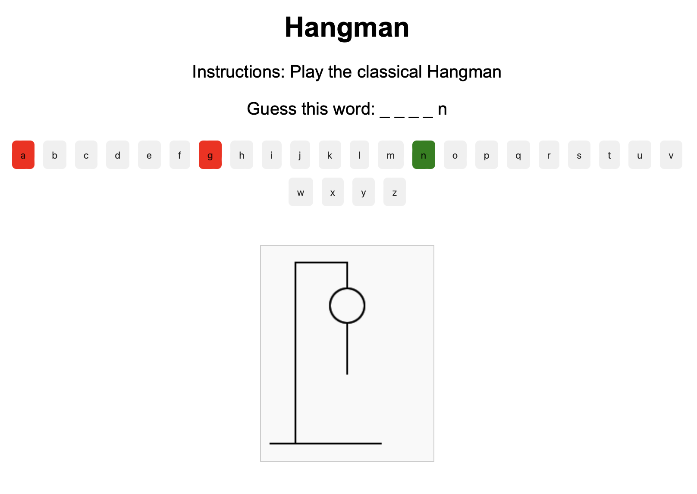

# Hangman-Game

### Gameplay

The player tries to guess a word by suggesting English alphabet letters within a certain number of guesses. Each incorrect guess brings the hangman drawing closer to completion. The game is won if the word is guessed before the hangman is fully drawn.

 

### Result

 
 

### Gameplay

The player tries to guess a word by suggesting English alphabet letters within a certain number of guesses. Each incorrect guess brings the hangman drawing closer to completion. The game is won if the word is guessed before the hangman is fully drawn.

 

### Requirements

 

##### Interface Layout 

 Utilize the provided HTML file for the game's interface, which includes specific areas for the hangman drawing, the word to be guessed with blanks for unknown letters, and an alphabet for letter selection. It is crucial that the HTML file remains unedited; instead, focus on utilizing JavaScript and CSS for game development tasks such as DOM manipulation, event management, validations, and styling. Ensure that all your code is well-commented.

 

##### Guess Limit and Hangman Drawing 

Players are permitted up to six incorrect letter guesses. With each incorrect guess, a part of the hangman will be drawn in the following order: head, trunk, right arm, left arm, right leg, and left leg.

 

##### Visual Feedback 

Provide immediate visual feedback for all player actions, including indications for incorrectly guessed letters and correctly guessed letters, to enhance user experience and game interaction.

 

##### Game Outcome Notifications

Use alerts to notify players of their victory or defeat at the end of the game. This simple method ensures players are clearly informed about the game outcome.

 

##### Word Selection

The word to be guessed should be hardcoded in your JavaScript using a variable. Initially, only one word is required for this assignment. However, you might consider incorporating a selection of words.

 
 

### Extra features

 

##### Custom Alerts

Instead of using default browser alerts for game outcomes, consider creating custom modal dialogs using HTML and CSS for a more integrated and visually appealing notification system.

 

##### Keyboard Input

Enhance the game by allowing players to use their keyboard to input guesses, in addition to clicking on the on-screen alphabet.

 

##### Extra words

As an advanced feature, implement the functionality to obtain or generate random words for gameplay. This can significantly increase the game's replayability and challenge.